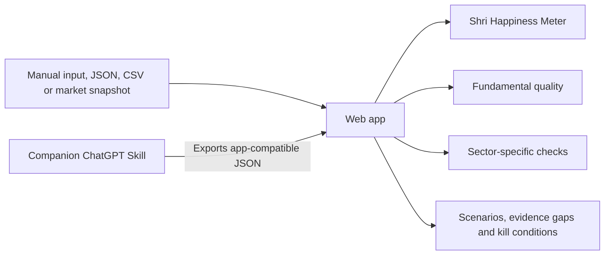

# Shri's Stock Brain

<p align="center">
  <strong>A cinematic, local-first stock philosophy explorer built around Shri's investing style.</strong>
</p>

<p align="center">
  <a href="https://shrinidhi13.github.io/shris-brain-app/">
    
  </a>
  <a href="https://github.com/shrinidhi13/shris-brain-app/archive/refs/heads/main.zip">
    
  </a>
  <a href="https://github.com/shrinidhi13/shris-brain-app/raw/refs/heads/main/skill%20%28analysis%20skill%29.zip">
    
  </a>
</p>

<p align="center">
  <a href="https://shrinidhi13.github.io/shris-brain-app/">Use the web app</a>
  ·
  <a href="https://github.com/shrinidhi13/shris-brain-app">View the repository</a>
  ·
  <a href="https://github.com/shrinidhi13/shris-brain-app/blob/main/skill%20%28analysis%20skill%29.zip">Open the Skill file on GitHub</a>
</p>

> [!NOTE]
> This is a **vibe-coded fun project** built for experimentation, learning and visual exploration. It uses AI-assisted development and should not be treated as a production investment platform.

## What is Shri's Stock Brain?

Shri's Stock Brain is an experimental stock-research interface that asks two different questions:

1. **Does this company match Shri's investing philosophy?**
2. **Is it fundamentally strong enough to deserve serious research?**

Those questions are intentionally kept separate. A company can look cheap, tangible and familiar while still being a weak business or a value trap.

The project contains two companion components:

- **Web app:** an animated browser experience with the Shri Happiness Meter, philosophy graph, sector checks, scenarios and evidence gaps.
- **ChatGPT Skill:** a research workflow that can investigate a listed company, apply the same philosophy and export app-compatible JSON.

> [!IMPORTANT]
> The web app and the ChatGPT Skill are companions, not a live-integrated system. The Skill can create a structured JSON result, and the user can then import that file into the web app. The browser does not invoke or execute the installed Skill directly.

## Try it

### Use the hosted web app

Open:

### [shrinidhi13.github.io/shris-brain-app](https://shrinidhi13.github.io/shris-brain-app/)

Nothing needs to be installed for the hosted interface.

### Download and run locally

Download the complete repository:

### [Download Shri's Stock Brain as a ZIP](https://github.com/shrinidhi13/shris-brain-app/archive/refs/heads/main.zip)

Extract it, open a terminal inside the extracted folder and run:

```bash
python3 serve.py
```

On Windows, either of these may also work:

```powershell
python serve.py
```

```powershell
py serve.py
```

Then open:

```text
http://127.0.0.1:8080
```

You can also clone the repository:

```bash
git clone https://github.com/shrinidhi13/shris-brain-app.git
cd shris-brain-app
python3 serve.py
```

A local HTTP server is recommended instead of opening `index.html` through `file://`, because local JSON loading, downloads and browser API requests behave more consistently over `http://127.0.0.1`.

## Download the companion ChatGPT Skill

### [Download the Skill ZIP directly](https://github.com/shrinidhi13/shris-brain-app/raw/refs/heads/main/skill%20%28analysis%20skill%29.zip)

Or open its GitHub file page:

### [View the Skill ZIP on GitHub](https://github.com/shrinidhi13/shris-brain-app/blob/main/skill%20%28analysis%20skill%29.zip)

Where user-created Skills are available, download the ZIP and import it through ChatGPT's Skills interface.

Example request after installing it:

```text
Analyze State Bank of India using Shri's Stock Brain.
Separate Shri Fit from Fundamental Quality, use current primary sources,
and export app-compatible JSON.
```

The intended handoff is:

```text
ChatGPT Skill
    ↓
structured stock research
    ↓
app-compatible JSON
    ↓
manual import into the web app
```

GitHub treats the Skill as a ZIP file, not as a browsable folder. To let visitors inspect every Skill source file online, the unpacked Skill can also be committed later under a directory such as `skill-source/`.

## Architecture



`serve.py` is only a small local static-file server. It is **not** a stock-analysis API.

The deterministic score runs in browser JavaScript. Optional Alpha Vantage requests are made directly from the visitor's browser.

## Highlights

- Animated **decision constellation** based on selected portfolio evidence and philosophy clusters.
- Neon-green animated **Shri Brain** at the centre of the graph.
- Transparent **Shri Happiness Meter**.
- Separate **philosophy-fit** and **fundamental-quality** scores.
- Sector-specific logic for:
  - Banks
  - NBFCs
  - Infrastructure and EPC
  - Power and utilities
  - Pharmaceuticals
  - Cyclicals
  - Automobiles
  - Real estate
  - Hospitality
- Value-trap warnings when a stock matches Shri's style but fails quality checks.
- Scenario lab, evidence-gap view, kill conditions and portfolio-overlap analysis.
- Editable philosophy weights.
- Import support for normalized JSON, Skill-output JSON and CSV.
- Optional free BSE end-of-day lookup through Alpha Vantage.
- Local browser storage only when the visitor explicitly chooses to remember settings.

## Philosophy model

The current model can be described as:

### India Tangible-Growth and Rerating Barbell

It looks for combinations of:

- Low or reasonable valuation.
- A visible rerating, turnaround or earnings-improvement trigger.
- Tangible assets or an understandable economic engine.
- India-specific structural growth.
- Asset backing, distribution, licences, concessions or cash returns.
- Willingness to accept volatility when downside appears supported.
- A smaller group of quality anchors balancing cyclical and turnaround positions.

The model is an editable hypothesis, not a permanent psychological diagnosis. Its weights can be adjusted inside the app.

## First run

1. Select **Play the brain tour** to explore the philosophy graph.
2. Open **Analyze** and try either built-in demonstration:
   - A regional bank that fits the philosophy and passes the quality screen.
   - An EPC company that looks Shri-like but is flagged as a possible value trap.
3. Upload one of the files in `sample-data/`.
4. Adjust the philosophy weights and observe how the result changes.
5. For an optional market snapshot, enter your own Alpha Vantage key and a supported BSE-form symbol.

## Accepted inputs

### Normalized JSON

Use the company input template in `sample-data/` as a starting point.

### Skill-output JSON

Import a structured result exported by the companion Skill.

### CSV

The app accepts a supported single-row or key-value CSV structure. Example files are included in `sample-data/`.

### Manual screen

Enter a smaller set of metrics for a quick deterministic result.

### Optional market lookup

The app can request a free end-of-day BSE snapshot using the visitor's own Alpha Vantage key. Free limits are small, and Indian fundamental coverage can be incomplete.

## Repository structure

```text
.
├── index.html
├── styles.css
├── profile.js
├── scoring.js
├── app.js
├── serve.py
├── sample-data/
├── TESTING.md
├── README.md
└── skill (analysis skill).zip
```

### Main files

- `index.html` — semantic interface.
- `styles.css` — visual system, responsive layout and motion.
- `profile.js` — philosophy calibration and decision constellation.
- `scoring.js` — browser-side deterministic scoring engine.
- `app.js` — interactions, canvas rendering, uploads and analysis workflow.
- `sample-data/` — templates and fictional test cases.
- `serve.py` — dependency-free local static server.
- `skill (analysis skill).zip` — companion ChatGPT Skill.

## Privacy

This public repository does **not** include:

- Amounts invested.
- Current portfolio value.
- Holding quantities.
- Average purchase prices.
- Holding-level profit or loss.
- XIRR.
- Brokerage account numbers.
- DP IDs.
- Login credentials.
- Personal API keys.

It does include selected stock names, explicit exclusions and an inferred investing philosophy. Anyone can inspect those details in the public source code.

No API key is bundled. Visitors who use the optional lookup must supply their own key. Never commit a personal or paid API key to this repository.

## Data reality

The project deliberately avoids hidden scraping.

Free market-data sources can be delayed, rate-limited or incomplete. A low-confidence or incomplete result should be treated as a request for more evidence, not as a stock verdict.

For serious research, independently verify:

- Current exchange filings.
- Annual and quarterly reports.
- Corporate announcements.
- Auditor commentary.
- Shareholding and dilution.
- Debt and contingent liabilities.
- Sector-specific regulatory issues.
- Current market price and valuation.

## Known limitations

- No automatic connection between the website and ChatGPT Skill.
- No secure backend or server-side secret storage.
- No guaranteed live Indian-market fundamentals.
- No automatic brokerage synchronization.
- No statistical return-correlation engine in the current graph.
- No target prices or guaranteed return forecasts.
- Results depend on the completeness and accuracy of supplied data.
- The philosophy model is calibrated from a limited set of examples.

## Roadmap

Possible future improvements:

- Secure backend for one-click research and structured results.
- Broader primary-source ingestion.
- Statistical portfolio-correlation analysis using aligned price histories.
- Shareable stock-analysis reports.
- Versioned philosophy profiles.
- Expanded sector-specific scoring.
- Optional private portfolio mode.
- Better data-provider integrations.

## Contributing

Issues, suggestions and pull requests are welcome.

Useful contributions include:

- Better sector checks.
- Additional fictional test cases.
- Accessibility improvements.
- Mobile and performance fixes.
- More transparent scoring explanations.
- Safer data-provider integrations.

Please do not submit real brokerage credentials, private API keys or another person's confidential portfolio data.

## Disclaimer

Shri's Stock Brain is an educational, experimental and vibe-coded project.

It is not:

- Personalized investment advice.
- A recommendation to buy, sell or hold a security.
- A target-price service.
- A promise or forecast of returns.
- A substitute for professional financial, legal, tax or regulatory advice.

Inputs and outputs may be stale, incomplete, incorrect or misleading. Independently verify current filings, market data, governance, valuation, liquidity, tax treatment and regulatory implications before making any investment decision.

## License

No license has been selected yet. Add a `LICENSE` file before inviting unrestricted reuse.

For a permissive open-source project, the MIT License is a common option. For a personal public showcase, the source can remain publicly viewable without granting broad reuse rights.
